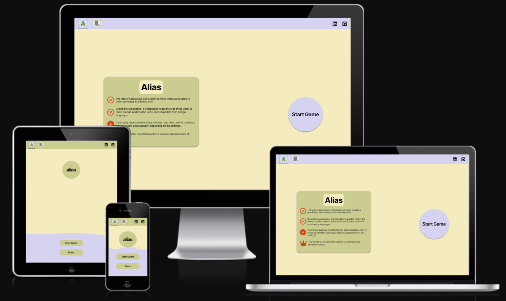
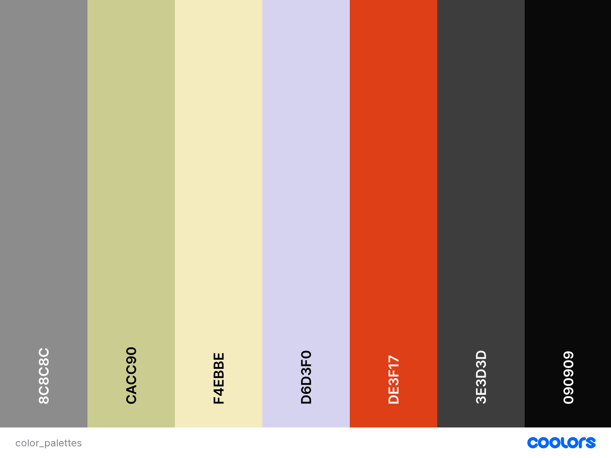

# Project name

Alias is an online browser game that revolves around teams, each comprising two or more members. In this game, one team member is assigned the task of explaining a given word using alternative words to their fellow team members.

The objective of this project is to create a dynamic front-end website that adapts to user interactions, modifying the presentation of information to fulfill the user's objectives.

[Link to the live site](https://dima-bulavenko.github.io/alias/)

# Contents

- [User Experience UX](#user-experience-ux)
  * [Target Audience](#target-audience)
  * [User Stories](#user-stories)
  * [Site Aims](#site-aims)
- [Design](#design)
  * [Wireframes](#wireframes)
  * [Site Structure](#site-structure)
  * [Color Scheme](#color-scheme)
  * [Typography](#typography)
- [Features](#features)
  * [Navigation](#navigation)
  * [Future Features](#future-features)
  * [Code Validation](#code-validation)
  * [Responsiveness](#responsiveness)
  * [Lighthouse testing](#lighthouse-testing)
  * [Accessibility testing](#accessibility-testing)
  * [Manual testing](#manual-testing)
- [Bugs](#bugs)
  * [Bugs Fixed](#bugs-fixed)
  * [Bugs Unfixed](#bugs-unfixed)
- [Technologies used](#technologies-used)
- [Deploying](#deploying)
- [Credits](#credits)
  * [Content](#content)
  * [Media](#media)
- [Acknowledgements](#acknowledgements)

<small><i><a href='http://ecotrust-canada.github.io/markdown-toc/'>Table of contents generated with markdown-toc</a></i></small>

# User Experience UX

## Target Audience

This site caters to a wide-ranging audience, including individuals of different ages, by providing various levels of difficulty tailored to accommodate diverse skill levels.

[Back to top](<#contents>)

## User Stories

- Enable users to access clear instructions on how to play the game.
- Allow users to reset the game at any point for a fresh start.
- Ensure a user-friendly interface that clearly displays the game elements.
- Display the current score of the game for users to stay informed about their progress.
- Implement clearly labeled buttons to give users intuitive control over the game.

[Back to top](<#contents>)

## Site Aims

The goal of the site is to offer friends an enjoyable and amusing time playing this game together.

[Back to top](<#contents>)

# Design

The site's design draws inspiration from the mobile application of the game "[play.google.com](https://play.google.com/store/apps/details?id=com.greylab.alias&hl=en_US&pli=1)". I've modified the structure of certain elements, completely overhauled the color scheme, and crafted an appearance specifically optimized for laptop screens.

[Back to top](<#contents>)

## Wireframes
[Back to top](<#contents>)

## Site Structure
[Back to top](<#contents>)

## Color Scheme

[Back to top](<#contents>)

## Typography
[Back to top](<#contents>)

# Features
[Back to top](<#contents>)

## Navigation
[Back to top](<#contents>)

## Future Features
[Back to top](<#contents>)

#Testing
[Back to top](<#contents>)

## Code Validation
[Back to top](<#contents>)

## Responsiveness
[Back to top](<#contents>)

## Lighthouse testing
[Back to top](<#contents>)

## Accessibility testing
[Back to top](<#contents>)

## Manual testing
[Back to top](<#contents>)

# Bugs
[Back to top](<#contents>)

## Bugs Fixed

* Delayed content loading when accessing a page ([fix commit](https://github.com/Dima-Bulavenko/alias/commit/5cd0fee3ca4d561ad4eec93b0cab96debecbcdca))

* The lack of setup for the content of "#round-timer" leads to issues in the proper functioning of checkIsRoundFinished(). ([fix commit](https://github.com/Dima-Bulavenko/alias/commit/a4a57020a4cfcd738539f3451d86aa802e942258))

* Didn't use "let" keyword in "for of" loop. ([fix commit](https://github.com/Dima-Bulavenko/alias/commit/16a062ede4b1a283a9951cfc04ca586b7230a311))

* Correct behavior for counting words when user refreshes page during a round ([fix commit](https://github.com/Dima-Bulavenko/alias/commit/50c7b34c1806f54ff64194f0e87018994dc26d64))

* Correct behavior of "#control" element when user click on it multiple times ([fix commit](https://github.com/Dima-Bulavenko/alias/commit/ec194a283515699a9f5402085f91490e42a103f5))

* Template of ".winner-team-info" wasn't deleted and appears on page. ([fix commit](https://github.com/Dima-Bulavenko/alias/commit/9176d5ec4656e959dc2b0cba8c989f1b5b3d4644))

[Back to top](<#contents>)

## Bugs Unfixed
[Back to top](<#contents>)

# Technologies used
[Back to top](<#contents>)

# Deploying
[Back to top](<#contents>)

# Credits
[Back to top](<#contents>)

## Content

* Custom range slider [w3schools.com](https://www.w3schools.com/howto/howto_js_rangeslider.asp)

* JavaScript MutationObserver [mozilla.org](https://developer.mozilla.org/en-US/docs/Web/API/MutationObserver)

* Fonts [fonts.google.com](https://fonts.google.com/).

* CSS linear-gradient [mozilla.org](https://developer.mozilla.org/en-US/docs/Web/CSS/gradient/linear-gradient)

* Custom checkbox styles [alvarotrigo.com](https://alvarotrigo.com/blog/css-checkbox-styles/)

* Wavy backgrounds [fireship.io](https://fireship.io/lessons/wavy-backgrounds/)

[Back to top](<#contents>)

## Media

* [Color palettes generator](https://coolors.co/)

* Favicon and logo [icons8](https://icons8.com/icons)

* Icons [Font Awesome](https://fontawesome.com/).

[Back to top](<#contents>)

# Acknowledgements
[Back to top](<#contents>)

