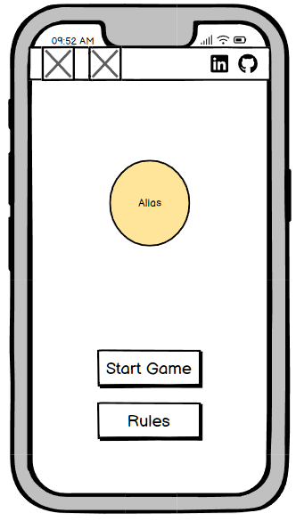

# Project name

Alias is an online browser game that revolves around teams, each comprising two or more members. In this game, one team member is assigned the task of explaining a given word using alternative words to their fellow team members.

The objective of this project is to create a dynamic front-end website that adapts to user interactions, modifying the presentation of information to fulfill the user's objectives.

[Link to the live site](https://dima-bulavenko.github.io/alias/)

# Contents

- [User Experience UX](#user-experience-ux)
  * [Target Audience](#target-audience)
  * [User Stories](#user-stories)
  * [Site Aims](#site-aims)
- [Design](#design)
  * [Wireframes](#wireframes)
  * [Site Structure](#site-structure)
  * [Color Scheme](#color-scheme)
  * [Typography](#typography)
- [Features](#features)
  * [Navigation](#navigation)
  * [Future Features](#future-features)
  * [Code Validation](#code-validation)
  * [Responsiveness](#responsiveness)
  * [Lighthouse testing](#lighthouse-testing)
  * [Accessibility testing](#accessibility-testing)
  * [Manual testing](#manual-testing)
- [Bugs](#bugs)
  * [Bugs Fixed](#bugs-fixed)
  * [Bugs Unfixed](#bugs-unfixed)
- [Technologies used](#technologies-used)
- [Deploying](#deploying)
- [Credits](#credits)
  * [Content](#content)
  * [Media](#media)
- [Acknowledgements](#acknowledgements)

<small><i><a href='http://ecotrust-canada.github.io/markdown-toc/'>Table of contents generated with markdown-toc</a></i></small>

# User Experience UX

## Target Audience

This site caters to a wide-ranging audience, including individuals of different ages, by providing various levels of difficulty tailored to accommodate diverse skill levels.

[Back to top](<#contents>)

## User Stories

- Enable users to access clear instructions on how to play the game.
- Allow users to reset the game at any point for a fresh start.
- Ensure a user-friendly interface that clearly displays the game elements.
- Display the current score of the game for users to stay informed about their progress.
- Implement clearly labeled buttons to give users intuitive control over the game.

[Back to top](<#contents>)

## Site Aims

The goal of the site is to offer friends an enjoyable and amusing time playing this game together.

[Back to top](<#contents>)

# Design

The site's design draws inspiration from the mobile application of the game "[play.google.com](https://play.google.com/store/apps/details?id=com.greylab.alias&hl=en_US&pli=1)". I've modified the structure of certain elements, completely overhauled the color scheme, and crafted an appearance specifically optimized for laptop screens.

[Back to top](<#contents>)

## Wireframes
I used [balsamiq](https://balsamiq.com/) to create wireframes

### Home page on Desktop 

### Home page on Mobile 

### Game page on Desktop 

###  Game page on Mobile 

[Back to top](<#contents>)

## Color Scheme
I used [coolors.co](https://coolors.co/) to generate this color palette.

[Back to top](<#contents>)

## Typography
I use [Inter Tight](https://fonts.google.com/specimen/Inter+Tight?query=Inter) font.

[Back to top](<#contents>)

# Features
[Back to top](<#contents>)

## Teams settings 
[link to team.html](https://dima-bulavenko.github.io/alias/teams.html)

* Add new team button. It adds new team to a game session (allowed no more then 6 team).

* The "Delete team" button. It deletes a team from a game session.

* The "Next" button. It saves chosen teams to localStorage and navigates to next settings' stage

[Back to top](<#contents>)

## Game settings
[link to team.html](https://dima-bulavenko.github.io/alias/settings.html)

* The "word count" input. It sets amount of words which a team must to achieve to win.

* The "Round duration" input. It sets a round's time.

* The "Penalty for a miss" input. It enables a one point penalty for missed word.

* The "Common final word" input. It enables all teams to guess the last word.

* The "Next" button. It saves chosen settings to localStorage and navigates to next settings' stage

[Back to top](<#contents>)

## Categories settings
[link to categories.html](https://dima-bulavenko.github.io/alias/categories.html)

* There are three buttons which define difficulty of game. It saves game words for corresponding level of difficulty and navigate user to game.html page.

[Back to top](<#contents>)

## Game section
[link to game.html](https://dima-bulavenko.github.io/alias/game.html)

* The game section has tree state of appearance (`before-round > round > after-round`). The states runs in a loop until some team get win.

### Before-round section
There are three parts of the `before-round` section

1. The first one show the "amount of words to win" and list of teams and them score.

2. The second one show a round number of certain team and team name which is going to play upcoming round.

3. The third one is a button that allows user to navigate to the next "`round`" section.

[Back to top](<#contents>)

### Round section
The `round` section has main features.

1. The first one shows a team name that is going to paly and number of `guessed` words.

2. The second one is the button `start` which runs the current round. After click on it, the word "Start" disappears and a explainable word to be shown.

3. The third one is the `guess` button. It allows team member, who is explaining, to add the word to guessed list.

4. The fourth one is the `miss` button. It allows team member, who is explaining, to add the word to missed list.

5. The last one shows amount of missed words and a countdown timer indicating the remaining time until the end of the round..

In the "Round" section, users on touch screen devices can make guesses by swiping up and register missed words by swiping down.

[Back to top](<#contents>)

### After Round section
The `after-round` section has three main features

1. The first one shows amount of points gotten for round and teams who got them.

2. The second one shows all words of round. User can change status of a word from "guessed" to "missed" and vise versa if he made mistake. 

3. The third one is button that adds earned points to corresponding team and 
navigates user either to the win page, if someone won, or to the `before-round` stage by changing current team.

[Back to top](<#contents>)

### Who guessed pop-up menu
The `Who guessed` pop-up menu appears in two cases if the [`"Common final word"` of the "Game settings"](<#game-settings>) was enabled.

1. The first case occur during the [`round` section](<#round-section>),When the round is over and a user has not yet processed the last word. After the processing the user will be offered to choose the team who guessed the last word.

2. The second case occur during the [`after-round` section](<#after-round-section>). When the user is trying to change state of the last word.

[Back to top](<#contents>)

## Win section
[link to win.html](https://dima-bulavenko.github.io/alias/win.html)

The `"Win section"` has three main features.

1. The first one shows a winner team name and his points.

2. The second one shows rest of teams with their points.

3. The third one is button that navigate user to the home page.

[Back to top](<#contents>)

## Future Features

* Add maintaining `different languages` so people all over the word will be able to paly this game.

* Add `sounds effects`.

* Create `online mode` of this game. It will allow users to play being in different places.

[Back to top](<#contents>)

#Testing
[Back to top](<#contents>)

## Code Validation
[Back to top](<#contents>)

## Responsiveness
[Back to top](<#contents>)

## Lighthouse testing
[Back to top](<#contents>)

## Accessibility testing
[Back to top](<#contents>)

## Manual testing
[Back to top](<#contents>)

# Bugs
[Back to top](<#contents>)

## Bugs Fixed

* Delayed content loading when accessing a page ([fix commit](https://github.com/Dima-Bulavenko/alias/commit/5cd0fee3ca4d561ad4eec93b0cab96debecbcdca))

* The lack of setup for the content of "#round-timer" leads to issues in the proper functioning of checkIsRoundFinished(). ([fix commit](https://github.com/Dima-Bulavenko/alias/commit/a4a57020a4cfcd738539f3451d86aa802e942258))

* Didn't use "let" keyword in "for of" loop. ([fix commit](https://github.com/Dima-Bulavenko/alias/commit/16a062ede4b1a283a9951cfc04ca586b7230a311))

* Correct behavior for counting words when user refreshes page during a round ([fix commit](https://github.com/Dima-Bulavenko/alias/commit/50c7b34c1806f54ff64194f0e87018994dc26d64))

* Correct behavior of "#control" element when user click on it multiple times ([fix commit](https://github.com/Dima-Bulavenko/alias/commit/ec194a283515699a9f5402085f91490e42a103f5))

* Template of ".winner-team-info" wasn't deleted and appears on page. ([fix commit](https://github.com/Dima-Bulavenko/alias/commit/9176d5ec4656e959dc2b0cba8c989f1b5b3d4644))

[Back to top](<#contents>)

## Bugs Unfixed
[Back to top](<#contents>)

# Technologies used
[Back to top](<#contents>)

# Deploying
[Back to top](<#contents>)

# Credits
[Back to top](<#contents>)

## Content

* Custom range slider [w3schools.com](https://www.w3schools.com/howto/howto_js_rangeslider.asp)

* JavaScript MutationObserver [mozilla.org](https://developer.mozilla.org/en-US/docs/Web/API/MutationObserver)

* Fonts [fonts.google.com](https://fonts.google.com/).

* CSS linear-gradient [mozilla.org](https://developer.mozilla.org/en-US/docs/Web/CSS/gradient/linear-gradient)

* Custom checkbox styles [alvarotrigo.com](https://alvarotrigo.com/blog/css-checkbox-styles/)

* Wavy backgrounds [fireship.io](https://fireship.io/lessons/wavy-backgrounds/)

[Back to top](<#contents>)

## Media

* [Color palettes generator](https://coolors.co/)

* Favicon and logo [icons8](https://icons8.com/icons)

* Icons [Font Awesome](https://fontawesome.com/).

[Back to top](<#contents>)

# Acknowledgements
[Back to top](<#contents>)

