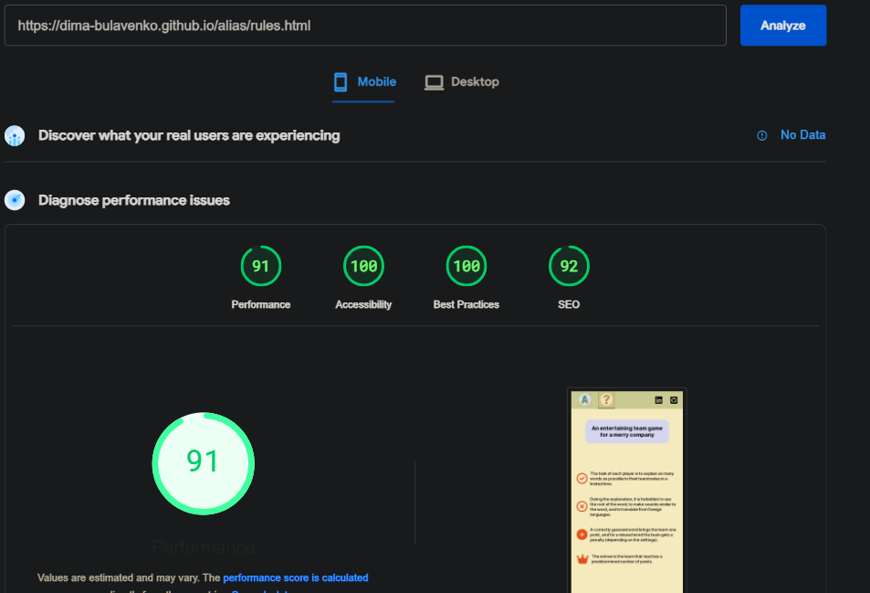

# Testing

I have meticulously examined the task management and project features manually, testing each button and link to ensure their proper functionality. Employing various browsers and devices during the testing process ensures the application's reliability and user-friendliness across different platforms.

[Back to README](../README.md#contents)

## Code Validation

### JavaScript Validation

I utilized the [JSHint](https://jshint.com/) online tool to validate the JavaScript code of Alias. The code successfully passed the validation without encountering any errors. This confirms that the JavaScript in Alias follows established coding practices, enhancing its reliability and performance.

### HTML Validation

-   [index.html](https://validator.w3.org/nu/?doc=https%3A%2F%2Fdima-bulavenko.github.io%2Falias%2Findex.html)

-   [rules.html](https://validator.w3.org/nu/?doc=https%3A%2F%2Fdima-bulavenko.github.io%2Falias%2Frules.html)

-   [teams.html](https://validator.w3.org/nu/?doc=https%3A%2F%2Fdima-bulavenko.github.io%2Falias%2Fteams.html)

-   [settings.html](https://validator.w3.org/nu/?doc=https%3A%2F%2Fdima-bulavenko.github.io%2Falias%2Fsettings.html)

-   [categories.html](https://validator.w3.org/nu/?doc=https%3A%2F%2Fdima-bulavenko.github.io%2Falias%2Fcategories.html)

-   [game.html](https://validator.w3.org/nu/?showsource=yes&doc=https%3A%2F%2Fdima-bulavenko.github.io%2Falias%2Fgame.html)

-   [win.html](https://validator.w3.org/nu/?showsource=yes&doc=https%3A%2F%2Fdima-bulavenko.github.io%2Falias%2Fwin.html)

### CSS Validation

-   [style.css](https://jigsaw.w3.org/css-validator/validator?uri=https%3A%2F%2Fdima-bulavenko.github.io%2Falias%2Findex.html&profile=css3svg&usermedium=all&warning=1&vextwarning=&lang=ru#warnings)

[Back to README](../README.md#contents)

## Responsiveness

Alias underwent extensive responsiveness testing using various software applications and online resources. The majority of the testing was conducted manually, utilizing [Chrome Developer Tools](https://developer.chrome.com/docs/devtools/) with multiple preset device dimensions available in the toolbar. After ensuring that the site layout performed well across different screen sizes, additional testing was carried out using [Am I Responsive](https://ui.dev/amiresponsive).

[Back to README](../README.md#contents)

## Lighthouse testing

### [Index.html](https://pagespeed.web.dev/analysis/https-dima-bulavenko-github-io-alias-index-html/ahagy9q3ue?form_factor=mobile)

[Back to README](../README.md#contents)

### [Rules.html](https://pagespeed.web.dev/analysis/https-dima-bulavenko-github-io-alias-rules-html/daw2n5lw4q?form_factor=mobile)

[Back to README](../README.md#contents)

### [Team.html](https://pagespeed.web.dev/analysis/https-dima-bulavenko-github-io-alias-teams-html/hox2n3xxfy?form_factor=mobile)

[Back to README](../README.md#contents)

### [Settings.html](https://pagespeed.web.dev/analysis/https-dima-bulavenko-github-io-alias-settings-html/6wit8f2h09?form_factor=mobile)

[Back to README](../README.md#contents)

### [Categories.html](https://pagespeed.web.dev/analysis/https-dima-bulavenko-github-io-alias-categories-html/4vap2sukby?form_factor=mobile)

[Back to README](../README.md#contents)

### [Game.html](https://pagespeed.web.dev/analysis/https-dima-bulavenko-github-io-alias-game-html/98r7yzmkmv?form_factor=mobile)

[Back to README](../README.md#contents)

### [Win.html](https://pagespeed.web.dev/analysis/https-dima-bulavenko-github-io-alias-win-html/l0w1ti65yu?form_factor=mobile)

[Back to README](../README.md#contents)
